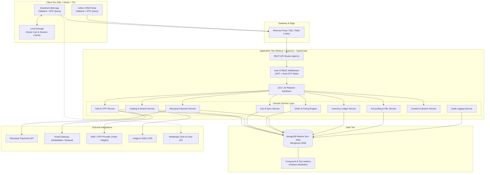
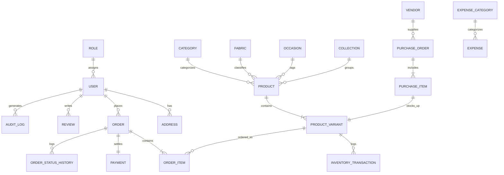
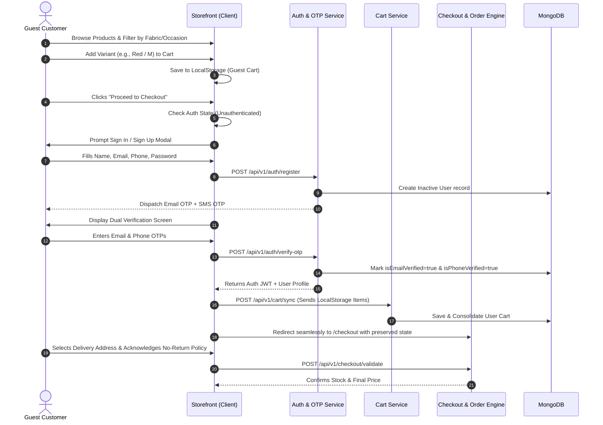
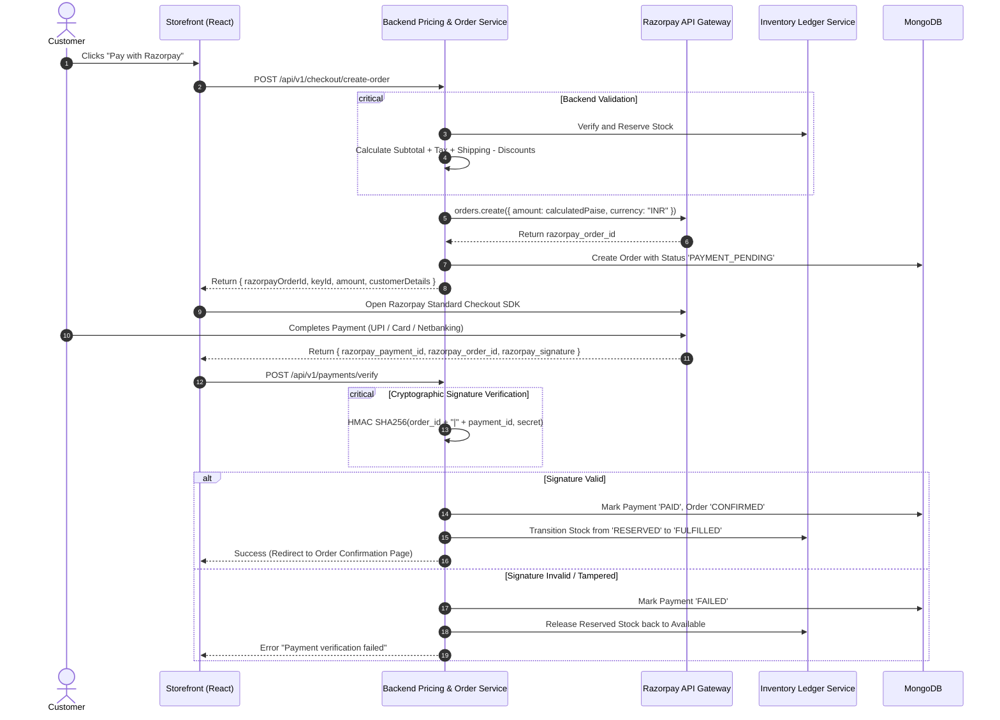
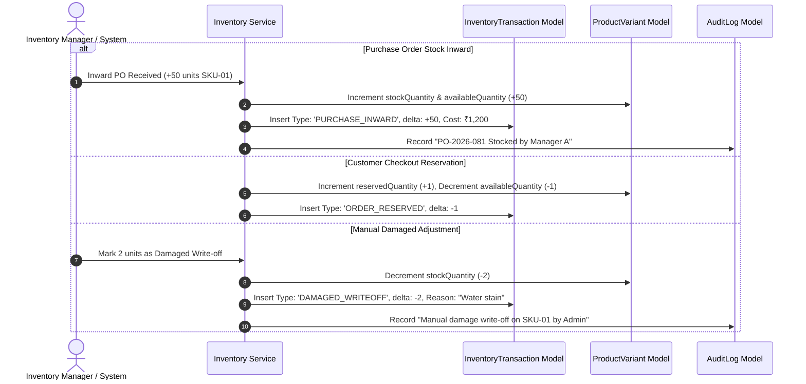

# THE FEMINA EXCLUSIVE — SYSTEM ARCHITECTURE & BLUEPRINT
**Luxury Female Fashion E-Commerce Platform + Enterprise Admin CRM**

---

## 1. Executive Summary & Brand Identity

**The Femina Exclusive** is a luxury female fashion brand specializing in premium ethnic, festive, party, and bespoke western wear. 
The digital platform is engineered as a high-performance, modular **MERN Stack** solution split into two distinct interfaces:
1. **Customer-Facing Shopping Experience**: Sophisticated, high-converting, mobile-first storefront featuring guest carts, frictionless authentication at checkout, dynamic attribute filtering (fabric, occasion, weave, craft), and strict policy enforcement (No Returns, Business-driven status updates without customer tracking).
2. **Enterprise Admin CRM & ERP**: Comprehensive operational back-office managing multi-variant Master Articles, dynamic taxonomy, double-entry ready accounting & expense tracking, purchase orders, vendor ledger, low-stock threshold monitoring, granular RBAC (Role-Based Access Control), and immutable audit logs.

---

## A. Complete Module Breakdown

```
THE FEMINA EXCLUSIVE ECOSYSTEM
│
├── CUSTOMER-FACING STOREFRONT
│   ├── 01. Navigation & Search Bar (Dynamic taxonomy, auto-suggest, attribute query engine)
│   ├── 02. Homepage & Showcase (Hero video banner, curated collections, lookbooks)
│   ├── 03. Catalogue & Filtering Engine (Multi-faceted filters: Fabric, Occasion, Color, Work, Price)
│   ├── 04. Product Detail (PDP) (High-res zoom, variant matrix, size guides, wash care)
│   ├── 05. Guest Cart & Wishlist (Local storage persistence + authenticated DB sync)
│   ├── 06. Identity & Verification (Email OTP + Phone SMS OTP, Session management)
│   ├── 07. Checkout & Address Manager (Address book, price validation, policy acknowledgement)
│   ├── 08. Payment Subsystem (Razorpay popup + Server-side signature verification)
│   ├── 09. Customer Account & Order History (Curated order stages, invoice download)
│   ├── 10. Brand Pages & Branches (About us, physical branches with Google Maps, Contact)
│   └── 11. Support Channels (Direct WhatsApp launcher + Email support dispatch)
│
└── ENTERPRISE ADMIN CRM & ERP
    ├── 01. Executive BI Dashboard (Gross/Net sales, P&L, inventory valuation, trend analytics)
    ├── 02. Article / Master Product Manager (Extensible fashion attributes, multi-variant SKU generator)
    ├── 03. Dynamic Taxonomy & Attributes (Categories, Subcategories, Fabrics, Occasions, Crafts)
    ├── 04. Inventory & Stock Movement Ledger (Audit-logged stock in/out, damaged goods, reservations)
    ├── 05. Order Processing & Fulfillment (State transitions, notes, printable packing slips)
    ├── 06. Payment Reconciliation (Razorpay reconciliation, transaction logs, refunds/disputes)
    ├── 07. Vendor & Procurement Management (Supplier directory, POs, Stock Inward automation)
    ├── 08. Accounting & Financial Engine (Expense tracking, COGS, Gross/Net margin calculation)
    ├── 09. Analytical Reporting & Exports (CSV/Excel/PDF exports for sales, stock, tax, vendors)
    ├── 10. Content & Storefront Customizer (Hero videos, banners, testimonials, branch locations)
    ├── 11. Customer Directory (LTV calculation, purchase histories, verification status)
    ├── 12. Staff RBAC & Permissions (Super Admin, Inventory, Sales, Accounts, Content roles)
    └── 13. System Audit Log (Immutable administrative activity trail with diffs)
```

---

## B. Complete Feature List (Release Phases)

| Module | MVP (Phase 1) | Phase 2 (Enhancement) | Future (Phase 3) |
| :--- | :--- | :--- | :--- |
| **Customer Storefront** | Responsive catalog, Rich PDP, Hero Video, Multi-attribute Filters, Guest Cart, Dual OTP (Email/SMS), Checkout, Address Book | Lookbooks, Customer Reviews with media, Size fit recommender, Coupon Engine | Virtual Dressing / AR drape preview, Live Shopping Broadcast |
| **Payments** | Razorpay Cards, UPI, Netbanking, Net Banking verification webhook | Automated instant refund adjustments for cancellations, Split payments | International currencies & Multi-gateway fallbacks |
| **Inventory** | SKU variant tracking, Low-stock alerts, Stock Inward via POs, Stock movement ledger | Barcode / QR generation & scanner integration, Multi-warehouse sync | Automated re-order forecasting using sales velocity ML |
| **Accounting** | Expense management, Revenue vs COGS, Gross & Net P&L reports, Vendor ledgers | Tax (GST) summary reports, Invoice PDF generation, Payment gateway fee tracking | Full double-entry general ledger, Tally / QuickBooks export integration |
| **Admin CRM** | Product Matrix CRUD, Order Status workflow, Customer 360 view, Dynamic taxonomy | Role custom permission builder, Bulk product import/export, Audit log analytics | WhatsApp notification automation (Order confirmation dispatch) |

---

## C. System Architecture



---

## D. Database ER & Schema Relationship Design

### Design Strategy: Hybrid Embedding vs Referencing
- **Embedded Documents**: Used where data is tightly bounded, read together, and requires point-in-time immutability (e.g., `Order.items` snapshots product name, SKU, price, fabric, variant info at purchase time; `User.addresses`).
- **Referenced Documents**: Used for high-growth, relational, or audited entities that are queried independently (e.g., `InventoryTransaction`, `Expense`, `PurchaseOrder`, `AuditLog`, `Product` ↔ `Category` / `Fabric`).



### Core Schema Specifications

#### 1. `User` & `Role` (RBAC + Verification)
```typescript
interface IUser {
  _id: ObjectId;
  firstName: string;
  lastName: string;
  email: string;
  phone: string;
  passwordHash: string;
  role: 'customer' | 'super_admin' | 'inventory_manager' | 'sales_manager' | 'accountant' | 'content_manager';
  isEmailVerified: boolean;
  isPhoneVerified: boolean;
  emailOtp?: { codeHash: string; expiresAt: Date; attempts: number };
  phoneOtp?: { codeHash: string; expiresAt: Date; attempts: number };
  savedAddresses: IAddress[];
  defaultAddressId?: ObjectId;
  isActive: boolean;
  lastLoginAt?: Date;
  createdAt: Date;
  updatedAt: Date;
}
```

#### 2. `Product` & `ProductVariant` (Master Fashion Article)
```typescript
interface IProduct {
  _id: ObjectId;
  articleCode: string; // e.g., TFE-2026-SLK-042
  name: string;
  slug: string;
  shortDescription: string;
  detailedDescription: string;
  category: ObjectId; // Ref Category
  subcategory?: string;
  collectionId?: ObjectId; // Ref Collection
  
  // Fashion Attributes (Extensible & Indexed)
  attributes: {
    fabric: string; // e.g., Chanderi Silk, Pure Cotton
    materialComposition?: string;
    texture?: string;
    weave?: string;
    pattern: string; // Printed, Solid, Embroidered
    workType: string[]; // Zari, Chikankari, Mirror Work, Gotta Patti
    style: string; // Anarkali, Straight, A-line
    fit: string; // Regular Fit, Slim Fit, Relaxed
    occasion: string[]; // Wedding, Festive, Daily Wear, Office
    season?: string;
    neckType?: string;
    sleeveLength?: string;
    closureType?: string;
    washCare: string[]; // Dry Clean Only, Gentle Hand Wash
  };
  
  hasVariants: boolean;
  basePrice: number;
  compareAtPrice?: number;
  costPrice: number; // For inventory valuation & COGS
  
  images: {
    url: string;
    altText: string;
    viewType: 'front' | 'back' | 'side' | 'texture_closeup' | 'model';
    isPrimary: boolean;
  }[];
  
  videoUrl?: string;
  tags: string[];
  isPublished: boolean;
  isFeatured: boolean;
  isNewArrival: boolean;
  isBestSeller: boolean;
  lowStockThreshold: number; // Default 5
  totalStock: number; // Denormalized aggregated sum of variant stocks
  ratingSummary: { average: number; count: number };
  createdAt: Date;
  updatedAt: Date;
}

interface IProductVariant {
  _id: ObjectId;
  productId: ObjectId; // Ref Product
  sku: string; // e.g., TFE-2026-SLK-042-RED-M
  color: { name: string; hexCode: string };
  size: 'XS' | 'S' | 'M' | 'L' | 'XL' | 'XXL' | '3XL' | 'FreeSize' | string;
  price: number;
  compareAtPrice?: number;
  costPrice: number;
  stockQuantity: number;
  reservedQuantity: number;
  availableQuantity: number; // stockQuantity - reservedQuantity
  barcode?: string;
  images?: string[];
  isActive: boolean;
}
```

#### 3. `InventoryTransaction` (Immutable Movement Ledger)
```typescript
interface IInventoryTransaction {
  _id: ObjectId;
  variantId: ObjectId;
  productId: ObjectId;
  sku: string;
  type: 'PURCHASE_INWARD' | 'ORDER_RESERVED' | 'ORDER_FULFILLED' | 'ORDER_CANCELLED' | 'MANUAL_ADJUSTMENT' | 'DAMAGED_WRITEOFF';
  quantityDelta: number; // Positive for increase, Negative for decrease
  previousStock: number;
  newStock: number;
  referenceId?: ObjectId; // OrderId, PurchaseId, or AdjustmentId
  reason: string;
  performedBy: ObjectId; // Ref User (Admin / System)
  costAtTransaction: number;
  createdAt: Date;
}
```

#### 4. `Order` & `OrderItem` (Snapshots & Fulfillment)
```typescript
interface IOrder {
  _id: ObjectId;
  orderNumber: string; // e.g., TFE-ORD-10492
  customer: {
    userId: ObjectId;
    fullName: string;
    email: string;
    phone: string;
  };
  items: {
    productId: ObjectId;
    variantId: ObjectId;
    productName: string;
    sku: string;
    color: string;
    size: string;
    image: string;
    unitPrice: number;
    unitCost: number; // Snapshot for P&L calculation
    quantity: number;
    subtotal: number;
  }[];
  
  shippingAddress: IAddress;
  
  pricing: {
    itemsSubtotal: number;
    discountAmount: number;
    shippingCharges: number;
    taxAmount: number;
    totalPayable: number;
  };
  
  paymentInfo: {
    paymentId?: ObjectId;
    method: 'RAZORPAY' | 'MANUAL_TRANSFER';
    razorpayOrderId?: string;
    razorpayPaymentId?: string;
    status: 'PENDING' | 'PAID' | 'FAILED';
    paidAt?: Date;
  };
  
  orderStatus: 'PAYMENT_PENDING' | 'PAID' | 'CONFIRMED' | 'PROCESSING' | 'PACKED' | 'SHIPPED' | 'DELIVERED' | 'CANCELLED';
  statusHistory: { status: string; timestamp: Date; note?: string; updatedBy: ObjectId }[];
  
  internalNotes: { note: string; authorId: ObjectId; createdAt: Date }[];
  policyAcknowledgement: {
    noReturnAcknowledged: boolean;
    acknowledgedAt: Date;
  };
  createdAt: Date;
  updatedAt: Date;
}
```

#### 5. `Accounting` (Expenses, Purchases & COGS)
```typescript
interface IExpense {
  _id: ObjectId;
  expenseCode: string; // e.g., EXP-2026-0034
  category: 'RENT' | 'SALARY' | 'UTILITY' | 'MARKETING' | 'PACKAGING' | 'SHIPPING' | 'PAYMENT_GATEWAY_FEE' | 'VENDOR_PAYMENT' | 'MISCELLANEOUS';
  description: string;
  amount: number;
  expenseDate: Date;
  paymentMethod: 'BANK_TRANSFER' | 'UPI' | 'CREDIT_CARD' | 'CASH';
  vendorPayee?: string;
  receiptAttachmentUrl?: string;
  recordedBy: ObjectId; // Ref User
  notes?: string;
  createdAt: Date;
}

interface IPurchaseOrder {
  _id: ObjectId;
  poNumber: string; // e.g., PO-2026-081
  vendorId: ObjectId; // Ref Vendor
  invoiceNumber: string;
  items: {
    variantId: ObjectId;
    productId: ObjectId;
    sku: string;
    quantityReceived: number;
    costPricePerUnit: number;
    taxRate: number;
    totalAmount: number;
  }[];
  totalCost: number;
  taxAmount: number;
  grandTotal: number;
  paymentStatus: 'PAID' | 'PARTIALLY_PAID' | 'PENDING';
  status: 'DRAFT' | 'CONFIRMED' | 'STOCKED';
  receivedDate: Date;
  recordedBy: ObjectId;
  createdAt: Date;
}
```

---

## E. Backend Clean Folder Architecture (Node + Express + TypeScript)

```
server/
├── src/
│   ├── config/               # Environment variables, DB connectors, Razorpay & Mailer configs
│   │   ├── database.ts
│   │   ├── env.ts
│   │   ├── razorpay.ts
│   │   └── mailer.ts
│   │
│   ├── constants/            # Enums, standard status codes, error dictionaries
│   │   ├── orderStatus.ts
│   │   ├── roles.ts
│   │   └── fashionTaxonomy.ts
│   │
│   ├── middlewares/          # Auth, RBAC, Validation, Error Handler, Audit Logger
│   │   ├── authenticate.ts
│   │   ├── authorizeRoles.ts
│   │   ├── validateRequest.ts
│   │   ├── rateLimiter.ts
│   │   └── errorHandler.ts
│   │
│   ├── models/               # Mongoose schemas & TypeScript Document definitions
│   │   ├── User.ts
│   │   ├── Product.ts
│   │   ├── ProductVariant.ts
│   │   ├── Category.ts
│   │   ├── Attribute.ts
│   │   ├── Order.ts
│   │   ├── InventoryTransaction.ts
│   │   ├── Expense.ts
│   │   ├── PurchaseOrder.ts
│   │   ├── Vendor.ts
│   │   ├── Content.ts
│   │   ├── Branch.ts
│   │   └── AuditLog.ts
│   │
│   ├── modules/              # Domain-Driven Feature Modules (Controller -> Service -> Repo)
│   │   ├── auth/
│   │   │   ├── auth.controller.ts
│   │   │   ├── auth.service.ts
│   │   │   ├── auth.routes.ts
│   │   │   └── auth.validation.ts
│   │   ├── products/
│   │   ├── inventory/
│   │   ├── orders/
│   │   ├── checkout/
│   │   ├── payments/
│   │   ├── accounting/
│   │   ├── vendors/
│   │   ├── reports/
│   │   ├── content/
│   │   └── audit/
│   │
│   ├── utils/                # Token generators, OTP crypt, PDF invoice engine, slugifiers
│   │   ├── tokenUtils.ts
│   │   ├── otpGenerator.ts
│   │   ├── apiResponse.ts
│   │   └── logger.ts
│   │
│   ├── types/                # Global TypeScript definitions & Express Request augmentations
│   │   └── express.d.ts
│   │
│   ├── app.ts                # Express app setup, CORS, Helmet, Route mounting
│   └── server.ts             # Server entrypoint with graceful shutdown
├── tests/                    # Unit, integration, and payment flow tests
├── package.json
└── tsconfig.json
```

---

## F. Frontend Scalable Folder Architecture (React + Vite + TypeScript)

```
client/
├── src/
│   ├── assets/               # Brand logos, fallback banners, custom vector icons
│   ├── components/           # Atomic & Shared Reusable UI Components
│   │   ├── common/           # Button, Input, Select, Modal, Drawer, Toast, Breadcrumbs
│   │   ├── feedback/         # LoadingSpinner, EmptyState, ErrorState, ConfirmDialog
│   │   ├── display/          # ProductCard, PriceDisplay, Badge, ZoomGallery, VideoPlayer
│   │   └── layout/           # CustomerNavbar, MobileNav, Footer, AdminSidebar, AdminHeader
│   │
│   ├── features/             # Feature Modules (Pages + Local Components + Redux Slices)
│   │   ├── customer/
│   │   │   ├── home/         # HeroVideo, CuratedCollections, FabricGrid, Lookbook
│   │   │   ├── shop/         # ProductGrid, MultiFilterDrawer, SortDropdown, SearchBar
│   │   │   ├── product/      # ProductDetail, VariantSelector, SizeGuide, WashCare
│   │   │   ├── cart/         # CartDrawer, CartPage, ItemRow, StockAlert
│   │   │   ├── checkout/     # Stepper, AddressPicker, PriceSummary, RazorpayModal
│   │   │   ├── auth/         # AuthModal, SignUpForm, EmailOtpModal, PhoneOtpModal
│   │   │   ├── profile/      # UserProfile, AddressBook, OrderHistory, OrderDetailCard
│   │   │   └── pages/        # AboutUs, BranchesMap, ContactUs, PolicyNotice
│   │   │
│   │   └── admin/
│   │       ├── dashboard/    # MetricCards, SalesChart, PnLSummary, LowStockTable
│   │       ├── products/     # ArticleList, ArticleCreateEditModal, VariantMatrix
│   │       ├── taxonomy/     # CategoryManager, FabricManager, OccasionManager
│   │       ├── inventory/    # StockLedger, ManualAdjustmentModal, InwardPO
│   │       ├── orders/       # OrderDataTable, OrderDetailView, StatusUpdater
│   │       ├── accounting/   # ExpenseList, AddExpenseModal, PnLReport, Valuation
│   │       ├── vendors/      # VendorDirectory, PurchaseOrderList, NewPOModal
│   │       ├── reports/      # SalesReport, ProductPerformance, ExportTools
│   │       ├── content/      # VideoBannerEditor, BranchEditor, Testimonials
│   │       └── audit/        # AuditLogTable, UserActivityStream
│   │
│   ├── store/                # Redux Toolkit + RTK Query API slices
│   │   ├── index.ts
│   │   ├── slices/           # authSlice, cartSlice, guestCartSlice, uiSlice
│   │   └── api/              # authApi, productApi, orderApi, adminApi, accountingApi
│   │
│   ├── hooks/                # Custom hooks (useAuth, useGuestCart, useRazorpay, useDebounce)
│   ├── services/             # Local storage persistence, Razorpay SDK loader
│   ├── routes/               # AppRoutes (Public, CustomerProtected, AdminRoleProtected)
│   ├── utils/                # Currency formatters, Date formatters, Validation schemas
│   ├── styles/               # Tailwind config, Custom typography, Glassmorphism
│   ├── App.tsx
│   └── main.tsx
├── package.json
└── vite.config.ts
```

---

## G. RESTful API Endpoint Specification

### 1. Authentication & User (`/api/v1/auth`, `/api/v1/users`)
- `POST /api/v1/auth/register` — Create initial account & trigger dual OTPs
- `POST /api/v1/auth/verify-email-otp` — Verify email OTP token
- `POST /api/v1/auth/verify-phone-otp` — Verify SMS OTP token
- `POST /api/v1/auth/resend-otp` — Resend verification OTP (rate-limited)
- `POST /api/v1/auth/login` — Sign in with credentials → Returns Access & Refresh JWT
- `POST /api/v1/auth/refresh-token` — Rotate session token
- `POST /api/v1/auth/logout` — Invalidate session
- `GET /api/v1/users/me` — Fetch current profile & verification flags
- `PUT /api/v1/users/me` — Update personal info
- `POST /api/v1/users/addresses` — Add saved delivery address
- `PUT /api/v1/users/addresses/:id` — Edit delivery address
- `DELETE /api/v1/users/addresses/:id` — Delete address

### 2. Catalog & Discovery (`/api/v1/products`, `/api/v1/taxonomy`)
- `GET /api/v1/products` — Filtered, paginated search (params: category, fabric, color, occasion, priceMin, priceMax, search, sort, page, limit)
- `GET /api/v1/products/:slug` — Full PDP details, variant matrix, stock flags
- `GET /api/v1/products/featured` — Featured showcase articles
- `GET /api/v1/products/new-arrivals` — New seasonal drops
- `GET /api/v1/taxonomy` — Aggregated taxonomy list (categories, fabrics, occasions, styles)

### 3. Cart & Checkout (`/api/v1/cart`, `/api/v1/checkout`)
- `POST /api/v1/cart/sync` — Merge guest cart from client into user DB cart upon login
- `POST /api/v1/checkout/validate` — Backend cart validation (checks real stock, calculates tax/discounts, returns official summary)
- `POST /api/v1/checkout/create-order` — Reserve inventory stock & generate Razorpay Order

### 4. Payments (`/api/v1/payments`)
- `POST /api/v1/payments/verify` — Validate Razorpay signature (`razorpay_order_id`, `razorpay_payment_id`, `razorpay_signature`) & finalize order
- `POST /api/v1/payments/webhook` — Razorpay webhook listener for asynchronous capture & failure reconciliation

### 5. Customer Orders (`/api/v1/orders`)
- `GET /api/v1/orders/my-orders` — Customer order list (with approved business statuses)
- `GET /api/v1/orders/my-orders/:id` — Detailed order breakdown & invoice

### 6. Admin Inventory & Articles (`/api/v1/admin/products`, `/api/v1/admin/inventory`)
- `GET /api/v1/admin/products` — Admin article management with cost prices & margins
- `POST /api/v1/admin/products` — Create new fashion article + variants
- `PUT /api/v1/admin/products/:id` — Update article details & pricing
- `POST /api/v1/admin/inventory/adjust` — Manual stock adjustment (requires reason & audit log)
- `GET /api/v1/admin/inventory/ledger` — Complete stock transaction history
- `GET /api/v1/admin/inventory/low-stock` — Real-time alerts on articles <= threshold

### 7. Admin Procurement & Accounting (`/api/v1/admin/purchases`, `/api/v1/admin/accounting`, `/api/v1/admin/expenses`)
- `POST /api/v1/admin/purchases` — Record PO / Stock Inward (automatically increments stock)
- `GET /api/v1/admin/expenses` — Expense ledger with filtering by category & date range
- `POST /api/v1/admin/expenses` — Log an operational expense (Rent, Packaging, Salaries)
- `GET /api/v1/admin/accounting/pnl` — Comprehensive P&L calculation (Revenue - Discounts - Taxes - COGS - Expenses - Gateway Fees = Net Profit)
- `GET /api/v1/admin/accounting/valuation` — Inventory valuation (Cost-based & Selling-based)

### 8. Admin BI Reports & Audit (`/api/v1/admin/reports`, `/api/v1/admin/audit-logs`)
- `GET /api/v1/admin/reports/sales` — Aggregate sales reporting by date/category/channel
- `GET /api/v1/admin/audit-logs` — Immutable audit trail of admin actions

---

## H. Detailed Flowcharts & Sequence Diagrams

### 1. Guest Shopping to Verified Checkout Flow



---

### 2. Razorpay Payment & Verification Flow



---

### 3. Inventory Movement & Audit Trail Flow



---

### 4. Accounting & Real-Time Profit Calculation Flow

$$\text{Gross Revenue} = \sum (\text{Order Items Sold Price}) + \text{Shipping Income}$$
$$\text{COGS (Cost of Goods Sold)} = \sum (\text{Order Items Snapshot Cost Price})$$
$$\text{Gross Profit} = \text{Gross Revenue} - \text{Discounts} - \text{COGS}$$
$$\text{Net Profit} = \text{Gross Profit} - \sum (\text{Operating Expenses}) - \text{Payment Gateway Fees} - \text{Tax Liabilities}$$

---

## L. Admin Role-Based Access Control (RBAC) Matrix

| Module / Resource | Super Admin | Inventory Manager | Sales Manager | Accountant | Content Manager |
| :--- | :---: | :---: | :---: | :---: | :---: |
| **Product Master Data & Variants** | Full (CRUD) | Full (CRUD) | View Only | View (Costs) | View / Edit Tags |
| **Inventory & Stock Adjustments** | Full (CRUD) | Full (CRUD) | View Only | View (Valuation)| None |
| **Procurement & Vendors (POs)** | Full (CRUD) | Full (CRUD) | None | View / Pay POs | None |
| **Customer Orders & Status Update**| Full (CRUD) | Pack / Ship | Full (CRUD) | View Only | None |
| **Expenses & Financial Reports** | Full (CRUD) | None | None | Full (CRUD) | None |
| **P&L & Accounting Ledger** | Full (CRUD) | None | None | Full (CRUD) | None |
| **Taxonomy & Attribute Settings** | Full (CRUD) | Create / Edit| None | None | Create / Edit |
| **Storefront Banners & Branches** | Full (CRUD) | None | None | None | Full (CRUD) |
| **Customer Data Directory** | Full (CRUD) | None | View & Support | None | None |
| **Admin User & Role Provisioning**| Full (CRUD) | None | None | None | None |
| **Audit Logs** | View All | None | None | None | None |

---

## M. Major Edge Cases & Mitigations

1. **Concurrent Stock Exhaustion**: Two users checkout the final piece simultaneously.
   - *Mitigation*: Atomic MongoDB `$inc` condition check (`{ availableQuantity: { $gte: requestedQty } }`) at order creation step to ensure no overselling.
2. **Abandoned Checkout / Expired Razorpay Sessions**: Customer initiates payment popup but closes browser.
   - *Mitigation*: Automatic background TTL scheduler / cron releases reserved inventory after 15 minutes if no verification or webhook confirmation is received.
3. **Price Alteration / Frontend Cart Manipulation**: Malicious client sends altered item prices in checkout payload.
   - *Mitigation*: Zero frontend price trust. All pricing is recalculated from database records directly during order creation.
4. **Guest Cart Variant Deletion / Price Change**: Item in guest cart is deactivated or price is revised before checkout.
   - *Mitigation*: On cart sync and checkout validation, real-time validation checks status and alerts user of any price updates or stock unavailability before payment.
5. **Network Disruption during Payment Confirmation**: Razorpay processes card, but client disconnects before reaching frontend verification.
   - *Mitigation*: Server-side Razorpay webhook listener receives `payment.captured` event and asynchronously fulfills order and dispatches notifications.

---

## N. Security & Best Practices

- **OWASP Compliance**: Parameterized queries via Mongoose ODM, Helmet HTTP headers, CORS whitelisting, XSS sanitization.
- **Authentication**: Bcrypt password hashing (salt rounds 12), JWT Access Token (short-lived 15m) + Secure HttpOnly Refresh Token (7 days) with rotation.
- **Rate Limiting**: Express rate limiting on `/api/v1/auth/*` and OTP generation endpoints to prevent brute-force attacks.
- **Zero Sensitive Storage**: No raw credit card data or payment secrets stored in DB or client-side storage.

---

## O. Incremental Development Roadmap

- **Milestone 1: Project Scaffolding & Core Architecture Setup**
  - Initialize Vite React TS frontend & Express TS backend.
  - Setup Tailwind CSS, Redux Toolkit, MongoDB connection, ESLint, Prettier, Error handlers.
- **Milestone 2: Master Database Models & Seed Data**
  - Implement Mongoose schemas: User, Role, Product, Variant, Category, Fabric, Occasion, InventoryTransaction, Expense.
  - Create rich initial seed dataset representing "The Femina Exclusive" fashion line (Sarees, Anarkalis, Lehengas, Kurtis with rich fabrics).
- **Milestone 3: Authentication, OTP Subsystem & RBAC**
  - Customer registration, dual verification (Email/Phone OTP), Login, JWT rotation.
  - Role-based authorization middleware for Admin and Customer routes.
- **Milestone 4: Customer Storefront UI & Discovery Experience**
  - Elegant luxury Homepage with Hero Video, Lookbooks, Featured Categories.
  - Shop catalogue with multi-faceted filtering (Fabric, Occasion, Color, Work, Price).
  - High-res PDP with variant switcher, image zoom, size guide, and wash care.
- **Milestone 5: Guest Cart, User Cart Sync & Checkout Flow**
  - LocalStorage guest cart with seamless transition to authenticated checkout.
  - Address book management, price validation engine, no-return policy notice.
- **Milestone 6: Razorpay Integration & Customer Order History**
  - Server-side Razorpay order creation & signature verification.
  - "My Orders" customer portal with business-driven order statuses.
- **Milestone 7: Admin CRM — Product & Inventory Management**
  - Multi-variant fashion article creator, dynamic taxonomy manager.
  - Low-stock alerts, manual stock adjustments, immutable stock movement ledger.
- **Milestone 8: Admin CRM — Procurement & Accounting Module**
  - Vendor management & PO Stock Inward.
  - Operational expense tracking, P&L reporting, Inventory valuation calculator.
- **Milestone 9: Admin CRM — BI Dashboard, Content & Audit Trail**
  - Executive KPI cards, sales analytics charts, hero video & branch manager, immutable audit log.
- **Milestone 10: End-to-End Testing & Production Hardening**
  - Test guest-to-checkout flows, payment failure edge cases, RBAC guards, responsive audits.
